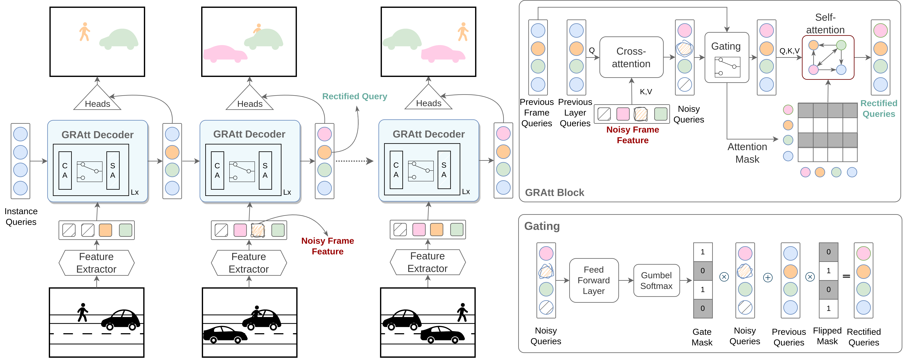

# GRAtt-VIS
[](https://arxiv.org/abs/2305.17096)
[](https://paperswithcode.com/paper/gratt-vis-gated-residual-attention-for-auto)

<p align="left"></p> 

This is an official Pytorch implementation of 
[GRAtt-VIS: Gated Residual Attention for Auto Rectifying Video Instance Segmentation](https://arxiv.org/abs/2305.17096). 
In this repository, we provide PyTorch code for training and testing our proposed GRAtt-VIS model. 
GRAtt-VIS is an efficient video instance segmentation and tracking model that achieves state-of-the-art results on 
several benchmarks, such as [YTVIS-19/21/22](https://youtube-vos.org/) and [OVIS](https://songbai.site/ovis/).

## Updates
* **`Jun 14, 2023`:** Code is now available!

## Installation
GRAtt-VIS is built upon VITA.
See [installation instructions](https://github.com/sukjunhwang/VITA/blob/main/INSTALL.md).

## Getting Started

We provide a script `train_net_grattvis.py`, that is made to train all the configs provided in GRAtt-VIS.
To train a model with "train_net_grattvisvis.py" on VIS, first
setup the corresponding datasets following
[Preparing Datasets](https://github.com/sukjunhwang/VITA/blob/main/datasets/README.md).
Then run with pretrained weights on target VIS dataset in [VITA's Model Zoo](https://github.com/sukjunhwang/VITA#model-zoo):
```
python3 train_net_genvis.py --num-gpus 4 \
--config-file configs/genvis/ovis/grattvis_R50_bs8.yaml \
MODEL.WEIGHTS weights/vita_r50_ovis.pth \
MODEL.GENVIS.USE_MEM False MODEL.GENVIS.GATED_PROP True \
OUTPUT_DIR your_output_dir
```

To evaluate a model's performance, use
```
python3 train_net_genvis.py --num-gpus 1 \
--config-file YOUR_MODEL_PATH/config.yaml \
--eval-only MODEL.WEIGHTS YOUR_MODEL_PATH/model_checkpoint.pth \
MODEL.GENVIS.USE_MEM False MODEL.GENVIS.GATED_PROP True \
OUTPUT_DIR your_output_dir
```

## <a name="ModelZoo"></a>Model Zoo
### YouTubeVIS-2019
| Backbone  |  AP  | AP50 | AP75 | AR1  | AR10 | Download |
|:---------:|:----:|:----:|:----:|:----:|:----:| :---: |
|   R-50    | 50.4 | 70.7 | 55.2 | 48.4 | 58.7 | [model](https://drive.google.com/file/d/1Uzi9SAIxvbLTvOGulxt0UsDscmJxsQnV/view?usp=drive_link) |
| Swin-L    | 63.1 | 85.6 | 67.2 | 55.5 | 67.8 | [model](https://drive.google.com/file/d/1Spvy7UOjOWuyNmxqe4ej3s1kGU-EAU6v/view?usp=drive_link) |

### YouTubeVIS-2021
| Backbone  |  AP  | AP50 | AP75 | AR1  | AR10 | Download |
|:---------:|:----:|:----:|:----:|:----:|:----:| :---: |
|   R-50    | 48.9 | 69.2 | 53.1 | 41.8 | 56.0 |[model](https://drive.google.com/file/d/1fKVbgwjWQFVS5hrO5bCo4gnz_TeG7jWT/view?usp=drive_link) |
| Swin-L    | 60.3 | 81.3 | 67.1 | 48.8 | 64.5 | [model](https://drive.google.com/file/d/1ov-vMx-OQtR5noCX5Vk6AqQo7vRD_rNB/view?usp=drive_link) |

### YouTubeVIS-2022
| Backbone  |  AP  | AP50 | AP75 | AR1  | AR10 | Download |
|:---------:|:----:|:----:|:----:|:----:|:----:| :---: |
|   R-50    | 40.8 | 60.1 | 45.9 | 35.7 | 46.9 | [model](https://drive.google.com/file/d/1zbsdqFaiZVU21qyTUlMZhEH7hh0k-GWl/view?usp=drive_link) |
| Swin-L    | 52.6 | 74.0 | 57.9 | 45.0 | 57.1 | [model](https://drive.google.com/file/d/1Lk0Au8_OqzfFCTBW5OGwW_v1czodAuOI/view?usp=drive_link) |

### OVIS
| Backbone  |  AP  | AP50 | AP75 | AR1  | AR10 | Download |
|:---------:|:----:|:----:|:----:|:----:|:----:| :---: |
|   R-50    | 36.2 | 60.8 | 36.8 | 16.8 | 40.0 | [model](https://drive.google.com/file/d/1YGHH4sHWC-qxb24p0i1ywr4kQu0bDALt/view?usp=drive_link) |
| Swin-L    | 45.7 | 69.1 | 47.8 | 19.2 | 49.4 | [model](https://drive.google.com/file/d/1w-0hDcWUOH9xCIl0PcDLiusoE0ZXYBKB/view?usp=drive_link) |

## License
The majority of GRAtt-VIS is licensed under a
[Apache-2.0 License](LICENSE).
However portions of the project are available under separate license terms: 
Detectron2([Apache-2.0 License](https://github.com/facebookresearch/detectron2/blob/main/LICENSE)), 
Mask2Former([MIT License](https://github.com/facebookresearch/Mask2Former/blob/main/LICENSE)), 
Deformable-DETR([Apache-2.0 License](https://github.com/fundamentalvision/Deformable-DETR/blob/main/LICENSE)), 
GENVIS([Apache-2.0 License](https://github.com/miranheo/GenVIS/tree/main#license)), and 
VITA([Apache-2.0 License](https://github.com/sukjunhwang/VITA/blob/main/LICENSE)).

## <a name="CitingGRAttVIS"></a>Citing GRAttVIS

If you find GRAtt-VIS useful in your research and wish to refer to the baseline results, please use the following BibTeX entry as a citation.
```BibTeX
@misc{hannan2023grattvis,
      title={GRAtt-VIS: Gated Residual Attention for Auto Rectifying Video Instance Segmentation}, 
      author={Tanveer Hannan and Rajat Koner and Maximilian Bernhard and Suprosanna Shit and Bjoern Menze and Volker Tresp and Matthias Schubert and Thomas Seidl},
      year={2023}, eprint={2305.17096}, archivePrefix={arXiv}, primaryClass={cs.CV}}
```

## Acknowledgement
We acknowledge the following repositories from where we have inherited code snippets.

1. [Detectron2](https://github.com/facebookresearch/detectron2)
2. [Mask2Former](https://github.com/facebookresearch/MaskFormer)
3. [VITA](https://github.com/sukjunhwang/VITA)
4. [GENVIS](https://github.com/miranheo/GenVIS)
